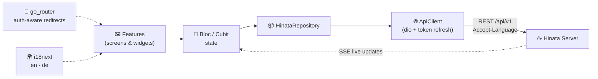

<!-- Logo -->
<p align="center">
  
</p>

<!-- Tagline -->
<p align="center">
  <b>Open-source, self-hosted project &amp; issue tracking — the Flutter app for the <a href="https://github.com/Ahmadre/Hinata-Server">Hinata Server</a>.</b><br>
  <sub>One codebase · Android · iOS · Web · macOS · no user or board limits, ever.</sub>
</p>

<!-- Badges -->
<p align="center">
  
  
  
  
  <a href="https://hinata-platform.github.io"></a>
</p>

<p align="center">
  <b>📖 Full documentation &amp; self-hosting guide: <a href="https://hinata-platform.github.io">hinata-platform.github.io</a></b> — bilingual (EN&nbsp;/&nbsp;DE)
</p>

<p align="center">
  <a href="https://hinata-platform.github.io"><b>Docs</b></a> ·
  <a href="#-screenshots">Screenshots</a> ·
  <a href="#-how-it-works">How it works</a> ·
  <a href="#-features">Features</a> ·
  <a href="#-architecture">Architecture</a> ·
  <a href="#-git-integration">Git integration</a> ·
  <a href="#-development">Development</a> ·
  <a href="#-releases">Releases</a> ·
  <a href="#-license">License</a>
</p>

---

## 🍯 Why Hinata

Hinata is a fully responsive, localized project-management client that runs from
a **single Flutter codebase** on phone, tablet, web and desktop. Layout adapts
through golden-ratio-derived breakpoints (no fixed pixel widths), and the UI
ships in **English (UK)** and **Deutsch (Deutschland)** via i18next — with error
messages localized **by the server** through the `Accept-Language` header.

> 🎨 **Design language** — a navy navigation rail, a warm-paper workspace and a
> signature honey-amber accent (`#D9A032`) that reads identically in light and
> dark mode, accented with subtle **liquid-glass** surfaces on the mobile nav,
> the ⌘K palette and the attachment lightbox.

---

## 🚀 How it works

| | Step | What happens |
|:-:|---|---|
| 🔌 | **Connect** | On first start the app asks for your server URL and only continues once the server answers. Native builds never bake in a URL — you can **save several servers and switch** between them, each with its own scoped tokens, from a liquid-glass server manager with live probe/ping. |
| 🛡️ | **Version gate** | The app compares its version with the server's `minAppVersion` on every start and forces an update when required. |
| 🧙 | **Setup wizard** | A fresh server is configured directly in the app (organization + first admin) — unless bootstrapped via `HINATA_SETUP_*`. |
| 🧭 | **Onboarding** | A one-time illustrated tour of the key features. |
| 🔑 | **Sign in** | Local credentials with optional **2FA (TOTP)**, **self-registration + e-mail verification** and forgot-password — or SSO (OpenID Connect, OAuth 2.0, SAML, LDAP — e.g. Synology SSO). SSO returns via the `hinata://auth-callback` deep link. |

---

## ✨ Features

<table>
  <tr>
    <td>📊 <b>Dashboard</b><br><sub>today's focus, completion, ranking, weekly tracker</sub></td>
    <td>📁 <b>Projects &amp; teams</b><br><sub>per-project workflows, keys &amp; members</sub></td>
    <td>🐛 <b>Issues</b><br><sub>epic → story → subtask hierarchy, dependencies, archiving</sub></td>
  </tr>
  <tr>
    <td>💬 <b>Comments</b><br><sub>threaded replies, reactions, voice notes, live (SSE)</sub></td>
    <td>📋 <b>Agile board</b><br><sub>drag &amp; drop, WIP limits, Board / Backlog / Timeline views</sub></td>
    <td>🏃 <b>Sprints</b><br><sub>plan, run &amp; review · capacity, points, burndown</sub></td>
  </tr>
  <tr>
    <td>📈 <b>Gantt / Timeline</b><br><sub>dependencies, start/due dates, progress</sub></td>
    <td>⏱️ <b>Timesheets</b><br><sub>weekly time tracking by activity</sub></td>
    <td>📑 <b>Reports</b><br><sub>burndown, velocity, cycle time, distributions</sub></td>
  </tr>
  <tr>
    <td>📎 <b>Attachments</b><br><sub>drag-drop grid, glass lightbox, live (SSE) sync</sub></td>
    <td>📚 <b>Knowledge base</b><br><sub>hierarchical Markdown, smart links</sub></td>
    <td>🔔 <b>Notifications</b><br><sub>in-app, e-mail &amp; push</sub></td>
  </tr>
  <tr>
    <td>🔍 <b>Command palette</b><br><sub>⌘K global search · recents &amp; triggers</sub></td>
    <td>👤 <b>Account</b><br><sub>2FA (TOTP), sessions, avatar, GDPR export/delete</sub></td>
    <td>🖥️ <b>Multi-server</b><br><sub>save &amp; switch servers · per-server tokens</sub></td>
  </tr>
  <tr>
    <td>⚙️ <b>Settings</b><br><sub>language, theme &amp; dark mode, privacy, versions</sub></td>
    <td>🛠️ <b>Admin</b><br><sub>SSO, mail-to-ticket, git apps, users, app settings</sub></td>
    <td>🏷️ <b>Reusable labels</b><br><sub>multi-select picker, project-wide tags</sub></td>
  </tr>
</table>

---

## 🧱 Architecture



<details>
  <summary><b>📦 Tech stack &amp; project layout</b></summary>

<br>

| Concern | Library |
|---|---|
| **State** | bloc · flutter_bloc · hydrated_bloc · bloc_concurrency · replay_bloc |
| **Routing** | go_router (auth-aware redirects) |
| **i18n** | i18next (`assets/i18n/{en,de}/common.json`) |
| **Networking** | dio (automatic token refresh, `Accept-Language`) |
| **Modals** | wolt_modal_sheet (sheet on phones, dialog on desktop) |
| **Charts** | fl_chart (burndown, velocity, completion) |
| **Glass UI** | `liquid_glass_widgets` (vendored under `packages/`, MIT) |
| **Attachments** | file_picker · desktop_drop · cross_file |
| **Export** | pdf · printing |

```text
lib/
  core/        theme, responsive system, i18n, api, models, blocs,
               router, storage, widgets
  features/    connect, setup, onboarding, auth, shell, dashboard,
               projects, issues, board, sprint, gantt, timesheet,
               reports, knowledge, search, notifications, settings, admin
packages/
  liquid_glass_widgets/   vendored glass surfaces (full control)
```
</details>

---

## 🔗 Git integration

Connect each project to **one or more** repositories on **GitHub, GitLab or
Bitbucket** to pull development info (branches, commits, pull/merge requests, CI
status) onto issues, drive **smart commits** and **status automation**, and
create branches straight from an issue. A project can track work across several
repos (e.g. an app **and** a server) — its issues aggregate development info from
all of them, grouped by repository.

There are **two layers** — set the first up once as the operator, then each
project connects its repositories:

| Layer | Who | Where | How often |
| --- | --- | --- | --- |
| **1 · OAuth app identity** | Operator / admin | *Admin area → Git integration* (or `HINATA_GIT_*` env) | **Once** per provider |
| **2 · Repository connection** | Project lead | *Project → Settings → Git integration → Add repository* | Per repo, per project |

> 💡 Layer 2 (per-project) only works once layer 1 exists — the provider needs a
> registered app to redirect users back to. This mirrors Atlassian's
> *GitHub for Jira*: **one** app, **many** repository connections.

### 1 · Register the OAuth app (operator, one-time)

The callback and webhooks must be reachable from the provider, so you need a
**public base URL** for the API. In production that's your API host; for local
testing expose it with a tunnel (e.g. ngrok) — the **public API base** is then
`https://<your-host>/api/v1`.

Create **one OAuth app per provider** and register this callback URL:

```text
<public-api-base>/git/oauth/callback
```

| Provider | Register at | Callback / redirect URL | Scopes |
| --- | --- | --- | --- |
| **GitHub** | *Settings → Developer settings → OAuth Apps → New OAuth App* | `<public-api-base>/git/oauth/callback` | repo · read/write metadata, contents, pull requests, issues, webhooks |
| **GitLab** | *User/Group → Settings → Applications* | `<public-api-base>/git/oauth/callback` | `api` · `read_repository` · `write_repository` |
| **Bitbucket** | *Workspace settings → OAuth consumers* | `<public-api-base>/git/oauth/callback` | account · repository · pullrequest · webhook |

Then enter the credentials in **Admin area → Git integration** (client id +
secret per provider, the **public API base URL**, and an optional token-encryption
secret) — **database values override the environment**. Alternatively configure
them purely via environment on the server:

<details>
  <summary><b>🔧 Server environment variables</b></summary>

<br>

| Variable | Purpose |
| --- | --- |
| `HINATA_GIT_GITHUB_CLIENT_ID` / `…_SECRET` | GitHub OAuth app credentials |
| `HINATA_GIT_GITLAB_CLIENT_ID` / `…_SECRET` | GitLab OAuth app credentials |
| `HINATA_GIT_BITBUCKET_CLIENT_ID` / `…_SECRET` | Bitbucket OAuth consumer credentials |
| `HINATA_GIT_WEBHOOK_BASE_URL` | Public API base (e.g. `https://<host>/api/v1`) used for the OAuth callback **and** webhook registration. Falls back to the server's own base URL when unset. |
| `HINATA_GIT_TOKEN_SECRET` | Key that encrypts stored access tokens at rest (**change the default in production**). |

</details>

Until a provider is configured, its **Authorize & install** button explains that
an admin must finish setup, and offers the URL + token fallback below.

### 2 · Connect a project's repository (project lead)

1. Open **Project → Settings → Git integration → Connect a repository**.
2. Pick the provider and choose **Authorize & install** — you're sent to the
   provider's consent screen and back; the app then lists your organisations and
   repositories to pick from.
3. Select the repository. A **webhook** is registered automatically at
   `<public-api-base>/git/webhooks/<provider>` (signed with a per-project secret),
   so pushes, pull/merge requests and CI results flow onto issues live.

> 🏢 **Self-managed** GitHub Enterprise, self-hosted GitLab or Bitbucket Data
> Center? Choose **Connect with a URL & access token** instead — paste the repo
> URL and a personal access token (`api` / `repo` scope). No admin OAuth app is
> required; the token is stored encrypted and used server-side only.

### Using it on issues

- **Smart commits** — reference an issue key in a branch name, commit message or
  PR title (e.g. `HN-42`) to link the work. Commit trailers `#comment`, `#time`
  and `#transition` add a comment, log time or move the issue.
- **Automation** — configure per project (in the same settings section) to move an
  issue when a branch is created or a pull/merge request is opened or merged.
- **Development panel** — a connected issue shows its branches, commits, PRs and
  deployment status, and lets you **create a branch** from the issue.

---

## 🛠️ Development

```bash
flutter pub get
flutter run
```

<details>
  <summary><b>🔧 Useful commands</b></summary>

<br>

```bash
flutter analyze && flutter test          # quality gate (CI runs the same)
dart run flutter_native_splash:create    # regenerate splash screens
dart run flutter_launcher_icons          # regenerate app icons
```
</details>

Start the backend as described in
[Hinata-Server/README.md](../Hinata-Server/README.md), then point the app at
`http://localhost:8080` (Android emulator: `http://10.0.2.2:8080`).

---

## 📦 Releases

Pushing a `v*` tag triggers [release.yml](.github/workflows/release.yml):

- 🤖 **Android** → Play Store *internal* track (`android/fastlane`, lane `internal`)
- 🍏 **iOS** → TestFlight (`ios/fastlane`, lane `beta`, signing via *match*)

<details>
  <summary><b>🔐 Required repository secrets</b></summary>

<br>

| Secret | Used for |
| --- | --- |
| `PLAY_JSON_KEY` | Play Console service account JSON |
| `ANDROID_KEYSTORE_BASE64`, `ANDROID_KEYSTORE_PASSWORD`, `ANDROID_KEY_ALIAS` | Upload keystore |
| `APP_STORE_CONNECT_API_KEY_ID`, `APP_STORE_CONNECT_ISSUER_ID`, `APP_STORE_CONNECT_API_KEY_CONTENT` | App Store Connect API key |
| `MATCH_GIT_URL`, `MATCH_PASSWORD`, `MATCH_GIT_BASIC_AUTHORIZATION` | fastlane match certificate repo |

</details>

> **Store compliance** — bundle id `com.ahmadre.hinata`; the privacy-policy URL shown
> in the app comes from the server (`HINATA_PRIVACY_POLICY_URL`), required for App
> Store / Play Store review and GDPR (DSGVO). The UI is accessibility-minded
> (BFSG): scalable text, semantic widgets, sufficient contrast.

---

## 📄 License

**GPL-3.0** — see [LICENSE](LICENSE).

<p align="center"><sub>Made with 🍯 by Rebar Ahmad</sub></p>