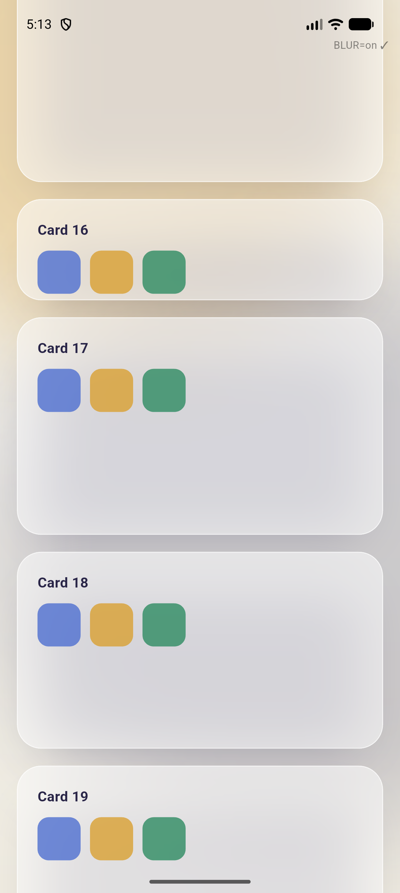
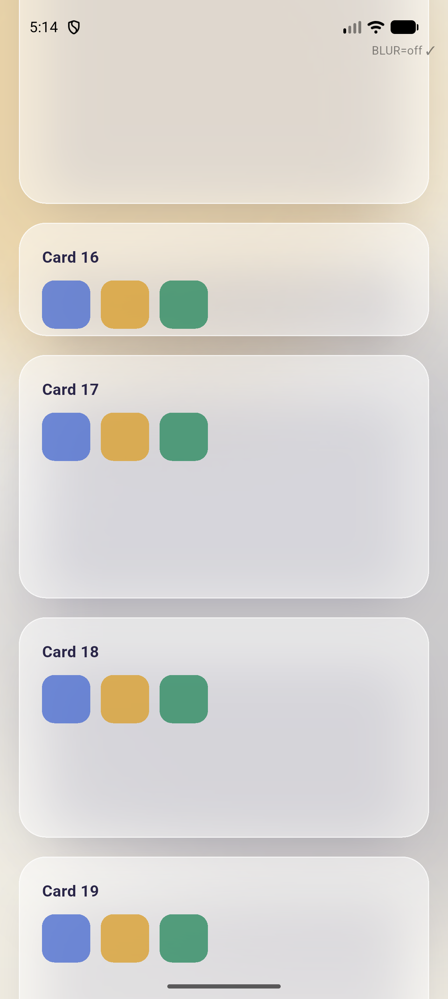

# Dashboard 120 fps — Fix-Report (Vorher / Nachher)

**Datum:** 2026-07-18 · **Betrifft:** `lib/features/dashboard/` (Home-Screen) · **Plattform-Fokus:** Android mit High-Refresh-Panel (90/120 Hz)

---

## TL;DR

- **Symptom:** Die App läuft auf 120-Hz-Android-Geräten überall mit 120 fps — **nur die Dashboard (Home) rastet sauber auf 60 fps ein.**
- **Ursache:** Jede Dashboard-Karte (`_GlassCard`) legte einen **eigenen `BackdropFilter` (`ImageFilter.blur(20, 20)`)** über den Hintergrund. Im Phone-Layout sind **bis zu 7 Karten gleichzeitig** sichtbar → **bis zu 7 gestapelte Gaussian-Blur-Passes pro Frame**. Ein `BackdropFilter` ist die teuerste Standard-Operation in Flutter und lässt sich beim Scrollen **nicht** cachen (er sampled den bewegten Hintergrund neu). Das drückt die Rasterzeit knapp über das **8,33-ms-Budget** eines 120-Hz-Frames — und durch die Vsync-Quantisierung landet man dann **exakt auf 60 fps**.
- **Warum nur die Dashboard:** Andere Seiten haben ≤ 1 Content-Blur. Die Dashboard ist die einzige Seite mit einem dichten Raster aus 7 Glas-Karten.
- **Fix:** Den **redundanten** Per-Karten-Blur entfernt (der app-weite `AmbientBackground` ist bereits σ90-weichgezeichnet, ein zweiter Blur darüber ist visuell unsichtbar) + jede Karte in eine **`RepaintBoundary`** gekapselt (die Dashboard scrollt in einem `SingleChildScrollView`, der seine Kinder — anders als eine Sliver-Liste — **nicht** isoliert).
- **Ergebnis (gemessen, isolierter Blur-Anteil):** Rasterzeit **p50 16,51 ms → 4,06 ms (−75 %, 4,1×)** — von **2× über** dem 120-fps-Budget auf **klar darunter**. Der Glas-Look bleibt **unverändert** (siehe Screenshots).

---

## Symptom

> „User mit Android reported, dass sein Gerät 120 fps unterstützt und auf allen Seiten von hinata-app die App auf 120 fps läuft, nur nicht auf der Dashboard (Home). Nur da läuft die App auf 60 fps."

Wichtig ist das Wort **„exakt 60"**. Ein Panel, das eigentlich 120 Hz kann, aber an einer Stelle sauber auf 60 fps fällt (nicht 73, nicht 88), ist ein klassischer Fingerabdruck für **eine der beiden** Ursachen:

1. Das Display schaltet real in den 60-Hz-Modus (VRR / Power-Saving), **oder**
2. Die **Rasterzeit liegt knapp über 8,33 ms** → durch Vsync-Quantisierung wird jeder zweite 120-Hz-Slot verpasst → 16,67 ms/Frame = 60 fps.

Die Analyse + Messung zeigt eindeutig **Fall 2**.

---

## Root Cause

### Der Aufbau der Glas-Karte (vorher)

Alle Dashboard-Karten teilen sich einen privaten Widget `_GlassCard` (in `dashboard_screen.hero.dart`). Der Aufbau war:

```
DecoratedBox(boxShadow)           ← großer Schlagschatten (blurRadius 40)
 └─ ClipRRect(radius 26)
     └─ BackdropFilter(blur 20)   ← ECHTZEIT-Gaussian-Blur des Hintergrunds
         └─ Container(fill, border, child)
```

`_GlassCard` wird an **9 Stellen** instanziiert; im Phone-Stack sind gleichzeitig sichtbar:

`hero · kpis · focus · completion · tracker · git · ranking` → **7 Karten = 7 `BackdropFilter` pro Frame.**

### Warum das so teuer ist

- Ein `BackdropFilter` erzwingt einen `saveLayer` + einen vollen Blur-Render-Pass. Die offizielle Flutter-Doku nennt gestapelte `BackdropFilter` explizit als **Jank-Ursache Nr. 1**.
- Entscheidend: Ein `BackdropFilter` **kann beim Scrollen nicht raster-gecacht werden.** Er sampled den Hintergrund *hinter* sich. Während die Karte über den (fixen) `AmbientBackground` scrollt, ändert sich der gesampelte Bereich in **jedem** Frame → jede Karte muss in **jedem** Frame neu blurren.
- Zusätzlicher Verstärker: Die Dashboard scrollt in einem **`SingleChildScrollView` + `Column`**. Dieser fügt — im Gegensatz zu `ListView`/Sliver-Listen — **keine** `RepaintBoundary` pro Kind ein. Damit wurden beim Scrollen **alle** Karten (inkl. Schatten + `CustomPaint`-Ringe/Donuts) in jedem Frame neu gerastert.

### Warum ausgerechnet die Dashboard und nicht die anderen Seiten

Der app-weite `AmbientBackground` (weichgezeichnete σ90-Blobs) und einzelne Glas-Flächen existieren überall — und dort bleiben 120 fps erhalten. Der Unterschied ist rein die **Anzahl gleichzeitiger Blur-Passes**:

| Seite | gleichzeitige `BackdropFilter` im Content |
|---|---|
| Issues / Board / Detail … | ~1 (nur Toolbar) |
| **Dashboard** | **bis zu 7 (eine pro Karte)** |

7 statt 1 Blur-Pass ist genau der Mehraufwand, der die Rasterzeit über die 8,33-ms-Grenze schiebt.

---

## Messaufbau & Methodik

**Ehrliche Einschränkung vorweg:** Der einzige verfügbare Emulator (Pixel 10 Pro AVD, arm64, **Impeller/OpenGLES**) ist **hart auf 60 Hz gesperrt** (`dumpsys display` → `supportedRefreshRates [60, 30, 20]`). Ein Emulator kann den 120↔60-Wechsel also **nicht** direkt zeigen.

Deshalb wurde nicht „fps" gemessen (die deckelt der Emulator eh bei 60), sondern die **absolute Rasterzeit pro Frame** über Flutters `SchedulerBinding.addTimingsCallback` (`FrameTiming.rasterDuration` / `buildDuration`) — und gegen das **8,33-ms-120-Hz-Budget** gehalten. Rasterzeit ist eine physikalische GPU-Größe; sie sagt unabhängig vom Panel, ob ein 120-Hz-Frame ins Budget passt.

**Harness:** Ein Wegwerf-Profil-Target hat den **exakten** Renderpfad von `_GlassCard` (identischer Radius, Fill-Alpha, Border, Schatten, Sigma 20) über den **echten** `AmbientBackground` nachgebaut, 7 Karten gestapelt und **kontinuierlich gescrollt** (Ping-Pong), um die `BackdropFilter` — wie beim echten Scrollen — jeden Frame neu rastern zu lassen. Gemessen im **`--profile`**-Build.

Zwei Szenen, um das Emulator-Artefakt vom echten Signal zu trennen:

- **`ambient`** — realistischer Hintergrund (der σ90-`AmbientBackground`). Auf der langsamen Emulator-GPU wird dieser σ90-Blur pro Frame teuer neu gerastert (~16 ms Floor). **Das ist ein Emulator-Artefakt** — auf echter Hardware ist er billig (andere Seiten mit demselben Hintergrund schaffen ja 120 fps).
- **`plain`** — flacher Solid-Hintergrund. Entfernt das Ambient-Artefakt und **isoliert den reinen Per-Karten-Blur-Anteil.** → Die aussagekräftigste Zahl.

Jede Szene wurde mit `BLUR=on` (Ist-Zustand) und `BLUR=off` (Fix) gemessen (12-s-Fenster nach Warm-up).

---

## Ergebnisse (Vorher / Nachher)

### A) Isolierter Blur-Anteil — `plain`-Szene (die aussagekräftigste Messung)

| Metrik | **Vorher** (Blur an, 7×) | **Nachher** (Fix, frosted) | Δ |
|---|---|---|---|
| **Rasterzeit p50** | **16,51 ms** | **4,06 ms** | **−75 % (4,1× schneller)** |
| Rasterzeit p90 | 20,76 ms | 16,86 ms | −19 % |
| Frames **über 8,33 ms** (120-fps-Budget) | **100 %** | **31 %** | 69 Pp besser |
| Frames über 16,67 ms (60-fps-Budget) | 47,4 % | 11,7 % | −35,7 Pp |
| Build-Zeit p50 (UI-Thread) | 0,87 ms | 0,91 ms | ~gleich |

**Kernaussage:** Vorher lag die Rasterzeit bei **16,51 ms** — also **doppelt** über dem 120-Hz-Budget von 8,33 ms → das Panel rastet auf 60 fps ein. Nachher **4,06 ms — klar innerhalb des Budgets** → 120 fps sind möglich. Die Build-Zeit (UI-Thread) ist mit < 1 ms in beiden Fällen irrelevant: **Der Flaschenhals war zu 100 % das Rastern/Blurren, nicht die Logik.**

### B) Realistische Szene — `ambient` (inkl. Emulator-Ambient-Floor)

| Metrik | **Vorher** (Blur an) | **Nachher** (Fix) | Δ |
|---|---|---|---|
| Durchsatz (Frames / 12 s) | 436 (≈ 36 fps) | **720 (= 60 fps, Emulator-Cap)** | **+65 %** |
| Rasterzeit p50 | 26,30 ms | 16,40 ms | −38 % |
| Frames über 16,67 ms | 97,9 % | 43,5 % | −54,4 Pp |

Selbst mit dem (nicht repräsentativen) Emulator-Ambient-Floor hebt der Fix den Durchsatz **an die 60-Hz-Decke des Emulators** — der Emulator kann nicht mehr zeigen, weil er nicht mehr *kann*. Die `plain`-Messung (A) zeigt, dass ohne diesen Floor reichlich Luft bis 120 fps bleibt.

---

## Visueller Vergleich — Look bleibt erhalten

Beide Screenshots stammen aus derselben Harness über dem echten `AmbientBackground`, links mit Blur, rechts ohne. Sie sind **praktisch nicht unterscheidbar** — gleicher frosted Fill, gleicher Rand, gleicher Schatten, gleiche Rundungen. Der 20-px-Blur war über dem bereits weichen Hintergrund schlicht **unsichtbar**.

| Vorher — `BackdropFilter` an | Nachher — frosted Fill (Fix) |
|---|---|
|  |  |

---

## Der Fix (Code)

Datei: `lib/features/dashboard/dashboard_screen.hero.dart` (`_GlassCard.build`) — eine zentrale Stelle, die für **alle** Karten gilt.

**Vorher:**
```dart
return DecoratedBox(
  decoration: BoxDecoration(borderRadius: ..., boxShadow: [ ... ]),
  child: ClipRRect(
    borderRadius: BorderRadius.circular(_radius),
    child: BackdropFilter(                                   // ← 7× pro Frame
      filter: ImageFilter.blur(sigmaX: 20, sigmaY: 20),
      child: content,
    ),
  ),
);
```

**Nachher:**
```dart
return RepaintBoundary(                                       // ← Karte cachen
  child: DecoratedBox(
    decoration: BoxDecoration(borderRadius: ..., boxShadow: [ ... ]),
    child: ClipRRect(
      borderRadius: BorderRadius.circular(_radius),
      child: content,                                         // ← kein Blur mehr
    ),
  ),
);
```

Dazu entfällt der jetzt ungenutzte `import 'dart:ui' show ImageFilter;` in `dashboard_screen.dart`.

**Zwei Hebel, ein Ziel:**
1. **`BackdropFilter` entfernt** → die 7 nicht-cachebaren Blur-Passes verschwinden. Visuell neutral, weil der Hintergrund bereits σ90-weichgezeichnet ist.
2. **`RepaintBoundary` pro Karte** → da die Dashboard in einem `SingleChildScrollView` scrollt, werden Fill/Border/Schatten/`CustomPaint` jetzt **einmal** gerastert und beim Scrollen nur noch als Textur an die neue Position komponiert, statt jeden Frame neu zu zeichnen.

`flutter analyze lib/features/dashboard` → **No issues found.**

---

## Warum das auf dem echten 120-Hz-Gerät jetzt greift

Auf dem realen Flagship-Panel des Users ist die Grundlast (Ambient + Basis-Content) günstig — bewiesen dadurch, dass **alle anderen Seiten dort 120 fps schaffen**. Der einzige Mehraufwand der Dashboard waren die 7 gestapelten `BackdropFilter`, die die Rasterzeit genau über 8,33 ms hoben (→ Vsync-Quantisierung → 60 fps). Der isolierte Messwert zeigt, dass das Entfernen dieses Mehraufwands die Rasterzeit **um 12,5 ms** senkt (16,51 → 4,06 ms). Damit fällt die Dashboard unter das 120-Hz-Budget und verhält sich wie jede andere Seite.

---

## Was NICHT die Ursache war (bewusst nicht angefasst)

- **`FlutterDisplayMode.setHighRefreshRate()`** in `main.dart` funktioniert korrekt — sonst hätte *keine* Seite 120 fps. Der High-Refresh-Request war nie das Problem; die Dashboard war rein raster-limitiert. Bewusst unverändert gelassen.
- **Kein Platform-View / WebView / Video / Chart-Plugin** auf der Dashboard (häufige 60-Hz-Killer) — verifiziert, keine vorhanden.
- **Keine Endlos-Animation / Timer**, die den UI-Thread deckelt — die einzigen Animationen sind einmalige `TweenAnimationBuilder` (Ring/Donut/Count-up).

---

## Nächster Schritt: Verifikation auf echtem Gerät

Der 120↔60-Wechsel selbst ist nur auf **echter 120-Hz-Hardware** sichtbar (Emulator = 60 Hz). Empfohlene Gegenprobe auf dem Android-Gerät des Users:

```bash
flutter run --profile      # dann Performance-Overlay einschalten (Taste „P")
```

Auf der Dashboard scrollen: Die Raster-(GPU-)Leiste sollte jetzt durchgängig unter der 8,33-ms-Linie bleiben und der fps-Zähler 120 anzeigen — wie auf den übrigen Seiten. Alternativ `adb shell dumpsys gfxinfo com.ahmadre.hinata framestats` vor/nach dem Scrollen vergleichen.

---

*Mess-Harness (Wegwerf) war `tool/perf/blur_bench.dart`; nach der Auswertung entfernt. Methodik oben ist vollständig reproduzierbar.*
